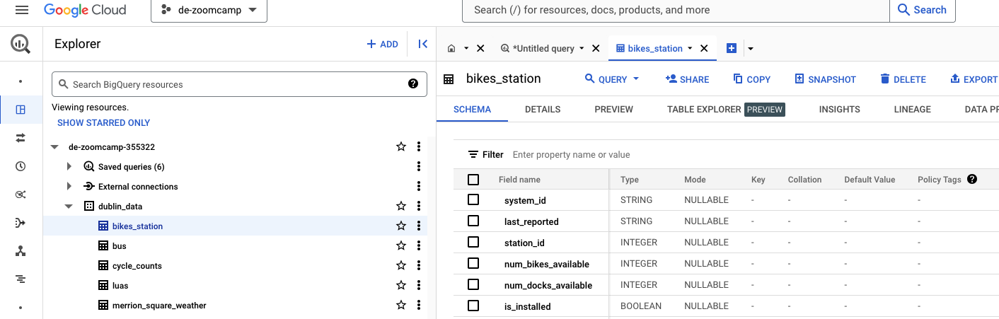
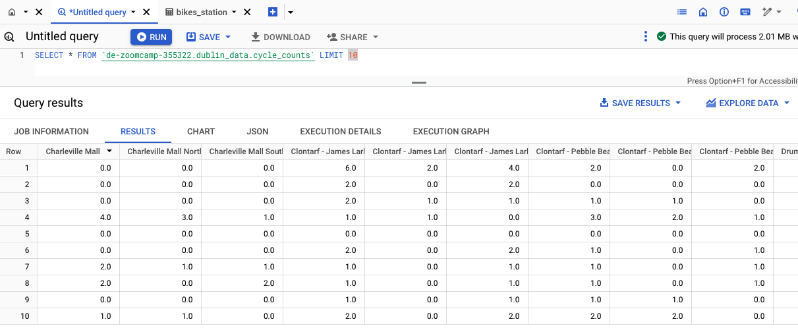

## Objective
Given 5 data sources, create a data pipeline with the tools that you want and upload the data to Snowflake

## Why Big Query instead of Snowflake?
I decided to choose Big Query because it is part of Google Cloud, it offers seamless integration with other Google services, providing a unified data handling experience that is particularly beneficial for those already using Google’s infrastructure. Its serverless nature eliminates the need for infrastructure management, allowing automatic scaling and resource adjustment. BigQuery’s unique pricing model, where charges are based on the data processed rather than on storage and compute, can be more cost-effective for sporadic large-scale data analyses. Additionally, BigQuery supports machine learning directly in the database with BigQuery ML, enabling data scientists to build and deploy models efficiently using SQL, further streamlining data workflows.

## Prerequisites for running the project
- To set up the required dependencies for running the Python scripts in this repository, follow the instructions in the [documentation](https://python-poetry.org/docs/) to install Poetry. Then, navigate to the root directory of the repository and run the command `poetry install`. This command creates a new environment based on the dependencies specified in [pyproject.toml](pyproject.toml), ensuring that you have the same library versions as I use and making it easy to run the scripts

- Use Prefect Cloud for configuring Secrets and Blocks that are used in the [flows](flows/). Here is a [guide](https://docs.prefect.io/ui/cloud-quickstart/) for configuring Prefect Cloud. And here are explained the concepts of [Blocks](https://docs.prefect.io/concepts/blocks/) and [Secrets](https://discourse.prefect.io/t/how-to-securely-store-secrets-in-prefect-2-0/1209)

## Data pipeline
The orchestration of the project is done via Github Actions located in [.github/workflows/](.github/workflows/) and Prefect flows which are in [flows/](flows/).

Github Actions is mainly used for running jobs (python scripts) via a cronjob and Prefect is responsible for creating the flows and connecting to Google Cloud services in a secure way using [Blocks](https://docs.prefect.io/concepts/blocks/) and [Secrets](https://discourse.prefect.io/t/how-to-securely-store-secrets-in-prefect-2-0/1209).

The pipeline runs every day at 6:00 am. But notice in the commented code at [.github/workflows/](.github/workflows/) that it also can be run every time a push is made to main branch

## Datawarehouse
5 tables were created in Big Query

    

    

## Challenges
One of the main challenges was creating a function that could be reutilized for downloading the majority of data sources. Other challenge was cleaning the data (long column names aren't accepted in Big query) without losing data integrity.
The functions created enable the search for data from other years for luas, bus, and weather.

Things that I would have improved: using [dbt](https://docs.getdbt.com/docs/build/documentation) for creating views and testing data integrity. Using google looker studio for having a graphical representation of the data.